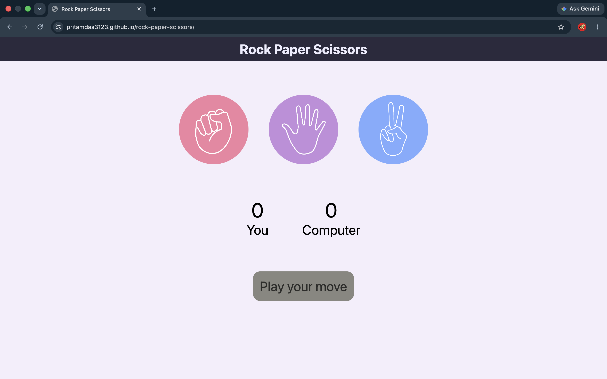
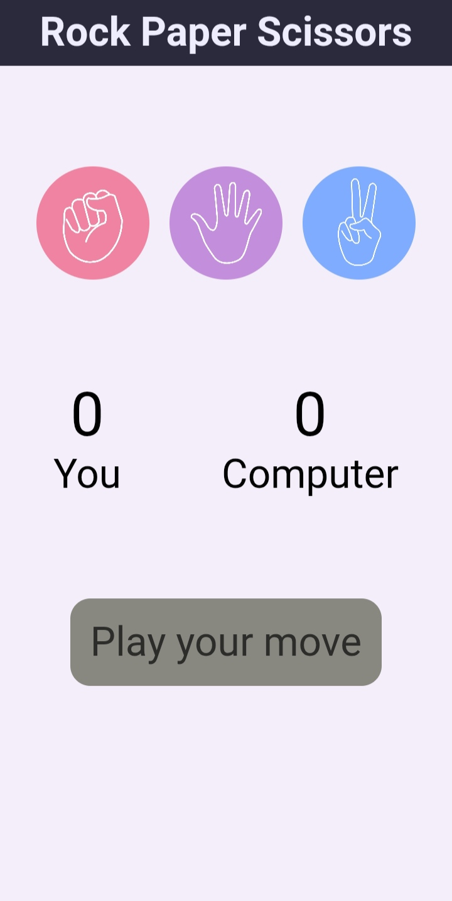

# Rock Paper Scissors

A Rock Paper Scissors game against the computer, built from scratch with vanilla HTML, CSS, and JavaScript — with no frameworks or libraries.

## Screenshots

| Desktop View | Mobile View |
|:---:|:---:|
|  |  |

## Features
- Classic Rock–Paper–Scissors gameplay against the computer
- Live score tracking for both player and computer
- Win / lose / draw states, each with distinct color feedback
- Fully responsive layout — playable on both desktop and mobile

## Built with


## Live Demo
**[pritamdas3123.github.io/rock-paper-scissors](https://pritamdas3123.github.io/rock-paper-scissors/)**

## How to Play
1. Click Rock, Paper, or Scissors to make your move.
2. The computer picks its move at random.
3. Rock beats Scissors, Scissors beats Paper, Paper beats Rock — the result and updated score appear instantly below.
4. Keep playing — the score keeps counting across rounds.

## Run It Locally
```bash
git clone https://github.com/pritamdas3123/rock-paper-scissors.git
cd rock-paper-scissors
```
Then just open `index.html` in your browser — no build step, no dependencies, no installation required.

## Project Structure
```
rock-paper-scissors/
├── index.html              # Page structure and markup
├── style.css               # Styling, layout, and animations
├── app.js                  # Game logic and event handling
├── images/
│   ├── rock.png
│   ├── paper.png
│   └── scissors.png
├── screenshots/
│   ├── screenshot-desktop.png
│   └── screenshot-mobile.png
└── README.md
```

## Possible Future Improvements
- Best-of-N match mode (e.g., first to 5 wins)
- Sound effects on win/lose/draw
- Move history log for the current session

## Author
**Pritam Das**

[](https://github.com/pritamdas3123)
[](https://www.linkedin.com/in/pritamdas3123)
[](mailto:pritamdas3123@gmail.com)